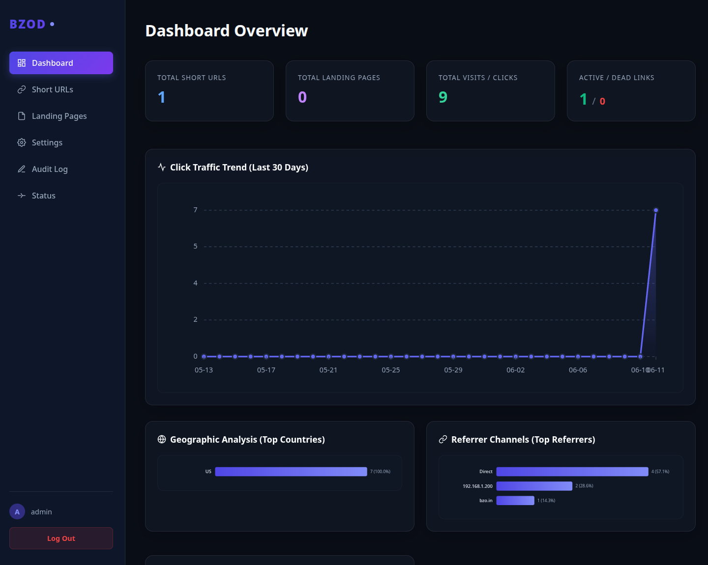
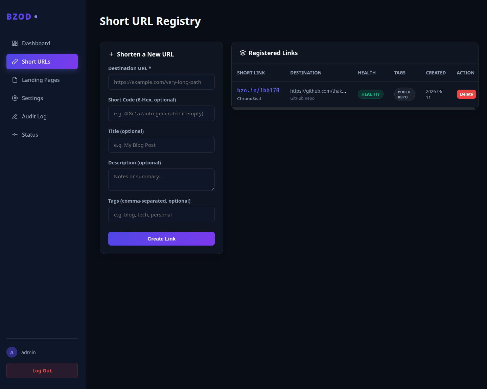
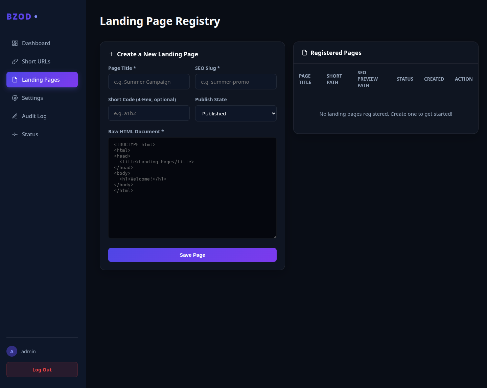
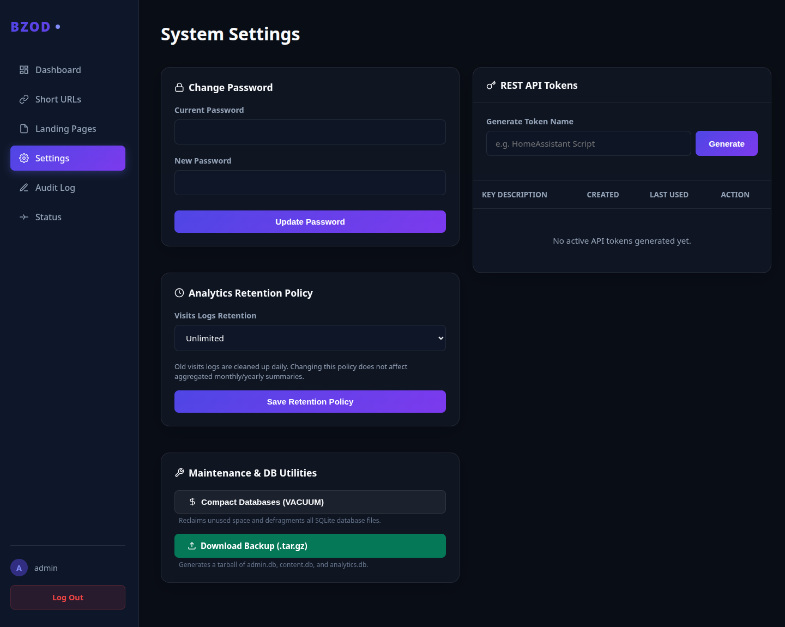
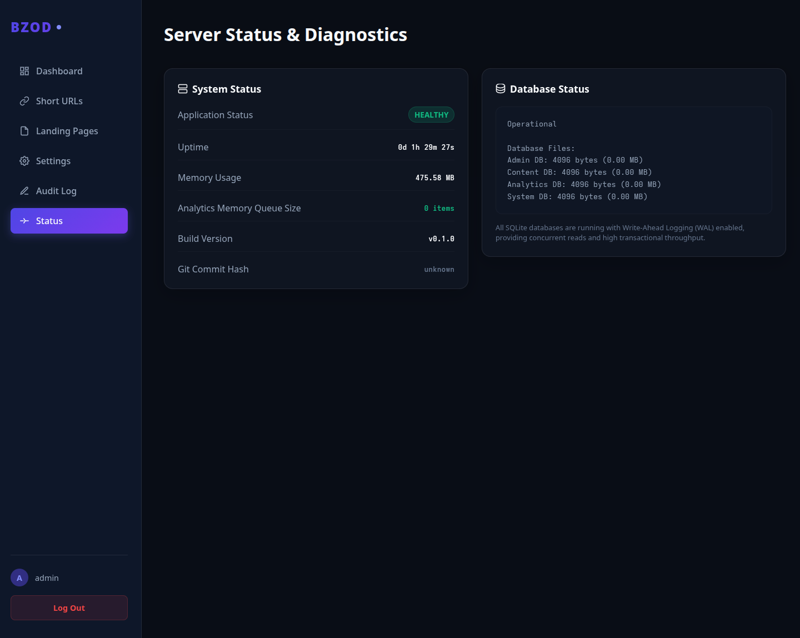

# nx9-url-shortener

A lightweight, self-hosted URL shortener and landing page platform written in Rust.

`nx9-url-shortener` is designed for individuals, organizations, and homelab operators who want complete control over their short links without relying on third-party services.

Built with Rust, SQLite, Axum, and Askama, it provides URL shortening, landing pages, analytics, audit logging, API access, and a web-based administration interface while maintaining a small deployment footprint.

---

## Features

### URL Shortening

Create short links using compact hexadecimal identifiers.

Example:

```text
https://<your-short-domain>/1bb170
```

Redirects to:

```text
https://very-long-domain-name.com
```

---

### Landing Pages

Create standalone landing pages using dedicated page identifiers.

Example:

```text
https://<your-short-domain>/p/1a2b
```

---

### Analytics

Track:

* Total visits
* Country statistics
* Referrers
* User agents
* Daily statistics
* Monthly statistics
* Yearly statistics

---

### Administrative Dashboard

Web-based administration interface featuring:

* URL management
* Landing page management
* API token management
* Audit logs
* Health checks
* Analytics dashboard
* SVG charts

---

### API Support

REST API endpoints for automation and integration.

```text
/api/v1/*
```

---

### Security

* Password-protected administration interface
* Session management
* CSRF protection
* API token authentication
* Audit logging

---

### Self-Hosted

No external services required.

Dependencies:

* Rust
* SQLite
* Docker (optional)

No:

* React
* Node.js
* Redis
* Kubernetes
* External databases

---

## Architecture

### Databases

The application uses four SQLite databases.

| Database     | Purpose                                  |
| ------------ | ---------------------------------------- |
| admin.db     | Users, sessions, API keys, audit logs    |
| content.db   | URLs, landing pages, tags                |
| analytics.db | Visits and statistics                    |
| system.db    | Jobs, migrations, backups, health checks |

---

## Default Credentials

Initial login:

```text
Username: admin
Password: admin
```

Change the password immediately after first login.

---

## Screenshots

### Dashboard



### Short URL Management



### Landing Pages



### Settings



### Server Status



---

## Docker Deployment

### Build

```bash
docker compose build
```

### Start

```bash
docker compose up -d
```

### View Logs

```bash
docker logs -f bzod
```

---

## Docker Compose Example

```yaml
services:
  bzod:
    build: .
    container_name: bzod
    restart: unless-stopped

    ports:
      - "8654:8654"

    volumes:
      - ./data:/app/data
      - ./config:/app/config

    environment:
      HOST: 0.0.0.0
      PORT: 8654
      DATA_DIR: /app/data
```

---

## Development

### Build

```bash
cargo build
```

### Run

```bash
cargo run -- serve
```

### Run Migrations

```bash
cargo run -- migrate
```

### Create Admin User

```bash
cargo run -- create-admin
```

### Run Tests

```bash
cargo test
```

---

## Project Structure

```text
src/
├── analytics/
├── auth/
├── charts/
├── cli/
├── db/
├── jobs/
├── models/
├── services/
├── templates/
├── utils/
└── web/
```

---

## Roadmap

Planned features:

* QR code generation
* Link expiration
* Link disabling
* CSV exports
* Bulk URL import
* GeoIP integration
* Multi-user administration
* SSO support

---

## Production Deployment

Recommended stack:

```text
Internet
    │
    ▼
Nginx Proxy Manager
    │
    ▼
nx9-url-shortener
    │
    ▼
SQLite
```

HTTPS is strongly recommended.

---

## License

Apache License 2.0

---

## Author

Sunil Purushottam Thakare

Built using Rust, SQLite, Axum, Askama, and a preference for simple, maintainable software.
