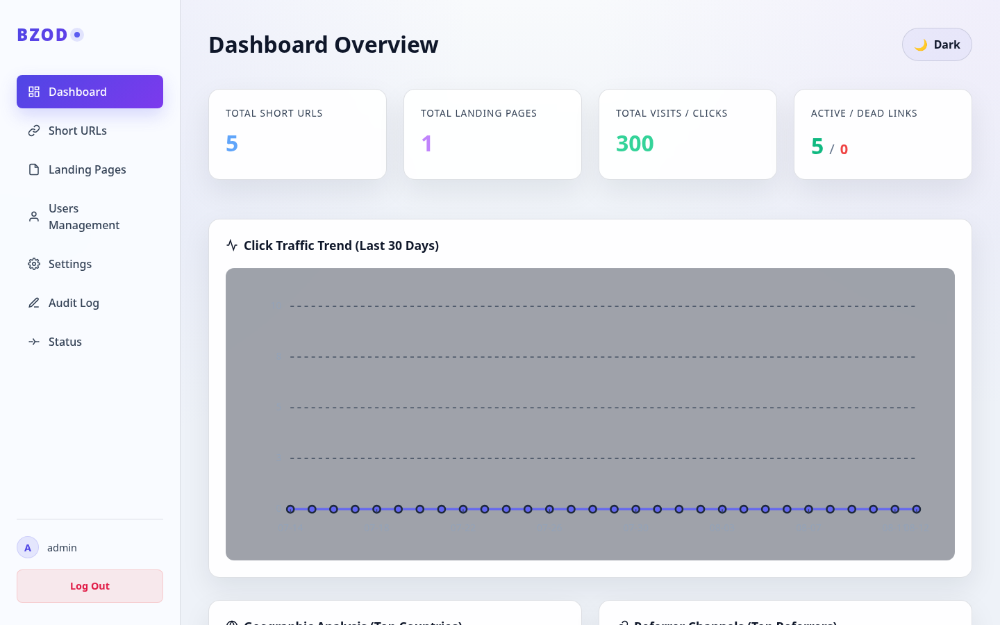
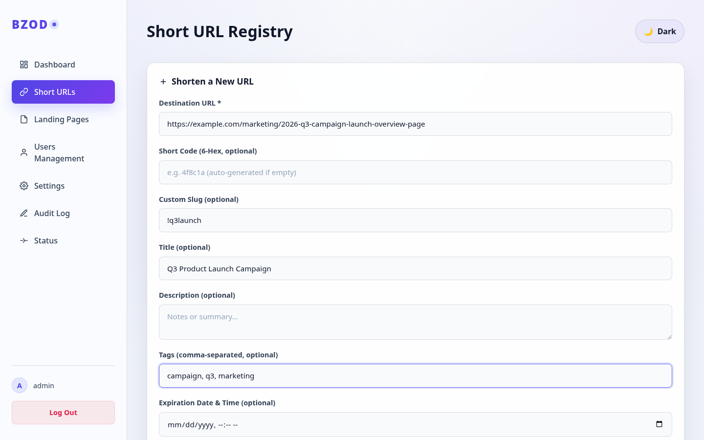
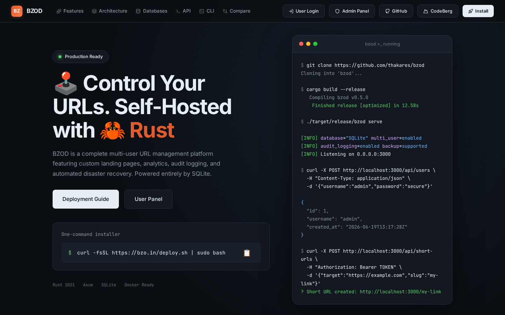
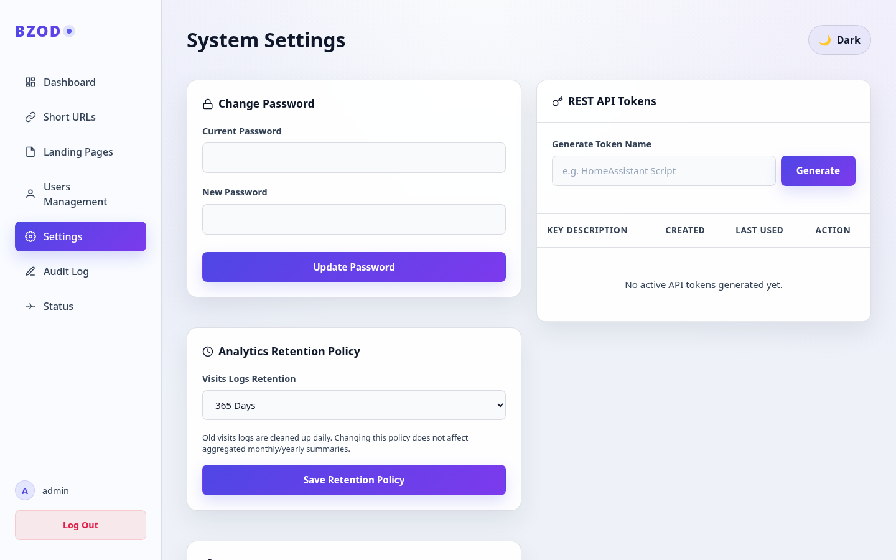
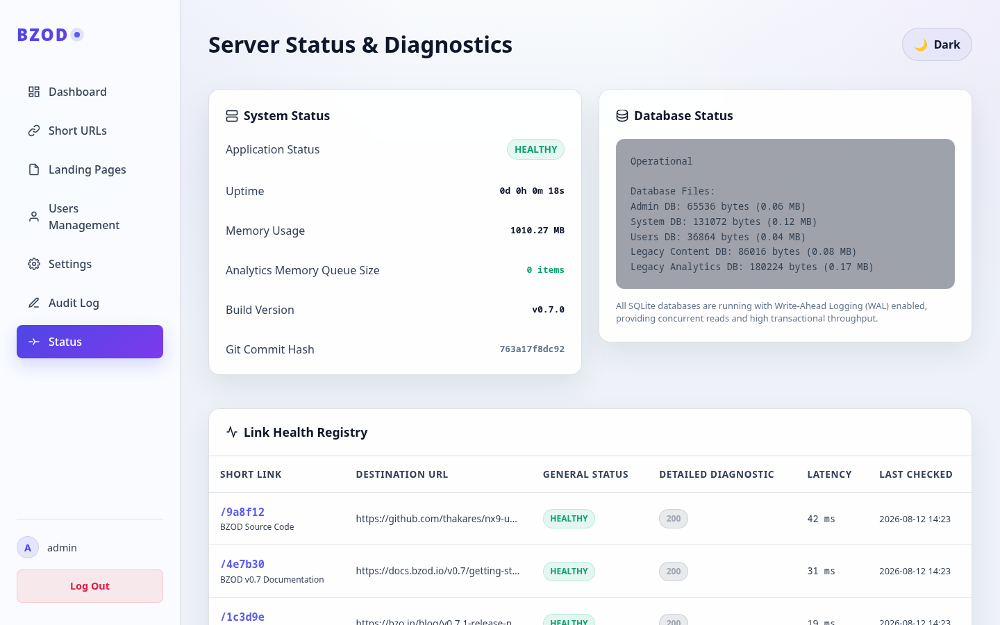

# nx9-url-shortener (the BZOD daemon)

**A lightweight, self-hosted URL management platform written in Rust.**

BZOD combines URL shortening, landing pages, QR code generation, password-protected links, smart preview pages, analytics, audit logging, lifecycle management, backup/restore, and API automation into a single self-hosted application with zero external service dependencies.

Built with Rust, SQLite, Axum, and Askama, BZOD is designed for individuals, organizations, homelab operators, government agencies, and businesses that want complete ownership of their links, analytics, and branding.

---
## License

Licensed under either of

- Apache License, Version 2.0
  ([LICENSE-APACHE](LICENSE-APACHE))
- MIT License
  ([LICENSE-MIT](LICENSE-MIT))

at your option.

### Contribution

Unless you explicitly state otherwise, any contribution intentionally
submitted for inclusion in this project shall be dual licensed under
the terms above without any additional terms or conditions.

[](#license)
---
## Highlights

### v0.4.0

* Raw visitor activity logs
* Analytics drill-down pages
* Visitor pagination
* Advanced sliding-window pagination
* CSV analytics export
* JSON analytics export
* Date-filtered analytics
* Landing page analytics
* Human-readable custom slugs
* Root landing page support
* UTM campaign builder
* Built-in backup and restore
* CLI shorten command
* CLI expand command
* QR code generation
* Password-protected links
* Smart preview pages
* Analytics dashboard
* Audit logging
* Health monitoring
* Human-readable custom slugs
* Root landing page support
* Landing page custom slugs
* UTM campaign builder
* Built-in backup and restore
* CLI shorten command
* CLI expand command
* QR code generation (PNG/SVG)
* Password-protected links
* Smart preview pages
* Analytics dashboard
* Audit logging
* Health monitoring

---

## Feature Matrix

| Feature                   | Status |
|---------------------------| ------ |
| URL Shortening            | ✅      |
| Custom Slugs              | ✅      |
| Landing Pages             | ✅      |
| Landing Page Custom Slugs | ✅      |
| QR Code Generation        | ✅      |
| QR Analytics              | ✅      |
| Password-Protected Links  | ✅      |
| Smart Preview Pages       | ✅      |
| Link Expiration           | ✅      |
| One/Multi-Time Links      | ✅      |
| Audit Trail               | ✅      |
| Analytics Dashboard       | ✅      |
| Health Monitoring         | ✅      |
| REST API                  | ✅      |
| Backup & Restore          | ✅      |
| UTM Campaign Builder      | ✅      |
| CLI Automation            | ✅      |
| Raw Visitor Logs          | ✅      |
| Analytics Export (CSV)    | ✅      |
| Analytics Export (JSON)   | ✅      |
| Analytics Drill-Down      | ✅      |
| Date Range Analytics      | ✅      |
| Advanced Pagination       | ✅      |
| Geo Analytics             | 🚧     |
| Multi-User Administration | 🚧     |
| SSO                       | 🚧     |

---
## One-Command Installation (Recommended)

```bash
curl -fsSL https://bzo.in/deploy.sh | sudo bash
```
---
## Features

### URL Shortening

Create compact short URLs using automatically generated hexadecimal identifiers.

Example:

```text
https://your-domain/1bb170
```

---
## Design Principles

BZOD is intentionally designed around a few principles:

- Self-hosted first
- SQLite-first architecture
- Minimal operational complexity
- Recovery over convenience
- Human-readable administration
- No external service dependencies
- No vendor lock-in

Features are added only when they improve usability without increasing architectural complexity.
### Custom Slugs

Create memorable human-readable links.

Examples:

```text
https://your-domain/!office
https://your-domain/!home
https://your-domain/!site
https://your-domain/!project-alpha
```

Features:

* Case-insensitive uniqueness
* Lowercase normalization
* Human-readable URLs
* No database schema changes
* Fully compatible with existing short codes

Examples:

```text
!office
!home
!warehouse
!meeting-room
!client_a
```
## Practical Examples

Generated URL
```
https://bzo.in/1b926e
```
Custom Slug
```
https://bzo.in/!myoffice
```
Landing Page
```
https://bzo.in/p/!company-profile
```
---
## CLI
```
bzod shorten https://example.com
bzod shorten https://example.com --slug !office
bzod expand !office
```
---
### Landing Pages

Create standalone landing pages hosted directly by BZOD.

Generated page:

```text
https://your-domain/p/1a2b
```

Custom slug page:

```text
https://your-domain/p/!company-profile
https://your-domain/p/!product-launch
```

Features:

* Raw HTML support
* SEO slug support
* Published / Draft states
* Custom paths
* Open Graph metadata

---
### CLI Commands

Core commands
```bash
bzod serve
bzod create-admin
bzod doctor
bzod stats
```
URL management
```bash
bzod shorten https://example.com
bzod shorten https://example.com --slug !campaign
bzod expand 1bb170
bzod expand !campaign
```
Maintenance
```bash
bzod backup
bzod restore --file backup_20250614.tar.gz
bzod migrate
```
### QR Code Generation

Generate QR codes for every short URL.

Supported formats:

* PNG
* SVG

Features:

* Downloadable QR assets
* QR scan analytics
* Bulk QR export
* Print-friendly SVG output

---

### Password-Protected Links

Protect sensitive links using Argon2id password hashing.

Features:

* Password gate
* Secure session handling
* Access restrictions
* Audit logging

---

### Smart Preview Pages

Display branded preview pages before redirecting visitors.

Features:

* Custom title
* Description
* Logo support
* Open Graph metadata
* Social sharing previews

---

### Link Lifecycle Management

Control link validity.

Features:

* Expiration dates
* One-time links
* Access limits
* Administrative disable
* Automated expiry jobs

---

### UTM Campaign Builder

Append campaign tracking parameters when creating links.

Supported parameters:

```text
utm_source
utm_medium
utm_campaign
```

Example output:

```text
https://example.com/page?utm_source=email&utm_medium=newsletter&utm_campaign=launch
```

No additional database schema changes are required.

---
### Analytics

Track:

* Total visits
* Unique visitors
* QR scans
* Countries
* Referrers
* User agents
* Daily statistics
* Monthly statistics
* Yearly statistics

Analytics drill-down includes:

* Raw visitor activity logs
* Visitor IP addresses
* Country information
* Referrer tracking
* Browser detection
* Raw User-Agent display
* Date range filtering
* CSV export
* JSON export
* Paginated visitor logs

Analytics Export

Export analytics data directly from the administration interface.

Supported formats:

* CSV
* JSON

Features:

* Memory-safe export handling
* Date-range filtering
* Downloadable files
* Compatible with spreadsheets and BI tools

---

### Audit Trail

Track administrative activity.

Recorded events include:

* Login
* Logout
* URL creation
* URL updates
* URL deletion
* Backup creation
* Restore operations
* QR exports
* Configuration changes

---

### Administrative Dashboard

Web-based management interface.

Features:

* URL registry
* Landing pages
* QR management
* Analytics
* API token management
* Audit logs
* Backup utilities
* Restore utilities
* Health monitoring
* Server diagnostics

---

### REST API

REST API support for automation and integrations.

Endpoint prefix:

```text
/api/v1/*
```

Supports:

* URL creation
* URL management
* Landing pages
* QR generation
* Analytics access

---

### CLI Automation

Create and manage links directly from the command line.

Examples:

Create automatic code:

```bash
bzod shorten https://example.com
```

Create custom slug:

```bash
bzod shorten https://example.com --slug !office
```

Expand code:

```bash
bzod expand 1bb170
```

Expand custom slug:

```bash
bzod expand !office
```

---

### Backup & Restore

BZOD includes integrated backup and restore functionality through both the CLI and Web UI.

CLI:

```bash
bzod backup
bzod restore --file backup.tar.gz
```

Web UI:

```text
Settings → Maintenance & DB Utilities
```

Features:

* Compressed tar.gz backups
* Full database restoration
* Backup validation
* Disaster recovery support
* No external tools required

Protected databases:

* admin.db
* content.db
* analytics.db
* system.db

---

### Security

* Password-protected administration
* Password-protected links
* Argon2id password hashing
* CSRF protection
* Session management
* API token authentication
* Audit logging
* Access controls

---

### Self-Hosted

No external services required.

Dependencies:

* Rust
* SQLite
* Docker (optional)

No:

* React
* Node.js
* Redis
* PostgreSQL
* MongoDB
* Kubernetes
* SaaS dependencies

---

## Architecture

### Databases

BZOD uses four SQLite databases.

| Database     | Purpose                        |
| ------------ | ------------------------------ |
| admin.db     | Users, sessions, API keys      |
| content.db   | URLs, landing pages, metadata  |
| analytics.db | Visits, QR scans, statistics   |
| system.db    | Audit events, jobs, monitoring |

---

## Initial Setup

### Native Installation

```bash
cargo run -- create-admin
```

### Docker

```bash
docker exec -it bzod bzod create-admin
```

---

## Disaster Recovery Validation

The backup and restore system has been validated through a complete recovery workflow.

Validation procedure:

1. Create backup archive
2. Stop application
3. Restore backup
4. Restart application
5. Verify application integrity

Verified components:

* URL registry
* Landing pages
* Analytics
* Audit logs
* API tokens
* QR assets
* Settings
* Health monitoring

Expected outcome:

The application returns to a fully operational state without data loss.

---

## Screenshots

### Dashboard



### URL Management



### Landing Pages



### Settings



### Server Status



---

## Docker Deployment

Build:

```bash
docker compose build
```

Start:

```bash
docker compose up -d
```

Logs:

```bash
docker logs -f bzod
```

---

## Docker Compose Example

```yaml
services:
  bzod:
    build: .
    container_name: bzod
    restart: unless-stopped

    ports:
      - "8654:8654"

    volumes:
      - ./data:/app/data
      - ./config:/app/config

    environment:
      HOST: 0.0.0.0
      PORT: 8654
      DATA_DIR: /app/data
```

---

## Development

Build:

```bash
cargo build
```

Run:

```bash
cargo run -- serve
```

Create administrator:

```bash
cargo run -- create-admin
```

Run tests:

```bash
cargo test
```

---

## Development & Testing

See:

```text
docs/TESTING.md
```

for testing, validation, backup, restore, disaster recovery, and release procedures.

---

## Project Structure

```text
src/
├── analytics/
├── auth/
├── charts/
├── cli/
├── db/
├── jobs/
├── models/
├── services/
├── templates/
├── utils/
└── web/
```

---

## Roadmap

Planned features:

* Geo analytics
* Multi-user administration
* SSO integration
* Signed temporary links
* OpenAPI documentation

---

## Production Deployment

Recommended architecture:

```text
Internet
    │
    ▼
Nginx Proxy Manager
    │
    ▼
BZOD
    │
    ▼
SQLite
```

HTTPS is strongly recommended.

---
## Documentation

- [Testing Guide](docs/TESTING.md)
- [Docker Deployment Guide](docs/DOCKER-Deploy.md)

---

## License

Apache License 2.0

---

## Author

Sunil Purushottam Thakare

Built with Rust, SQLite, Axum, Askama, and a preference for simple, maintainable software.
